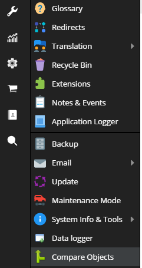
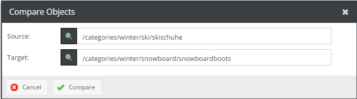
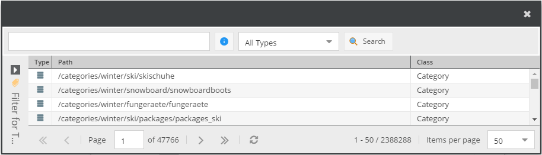
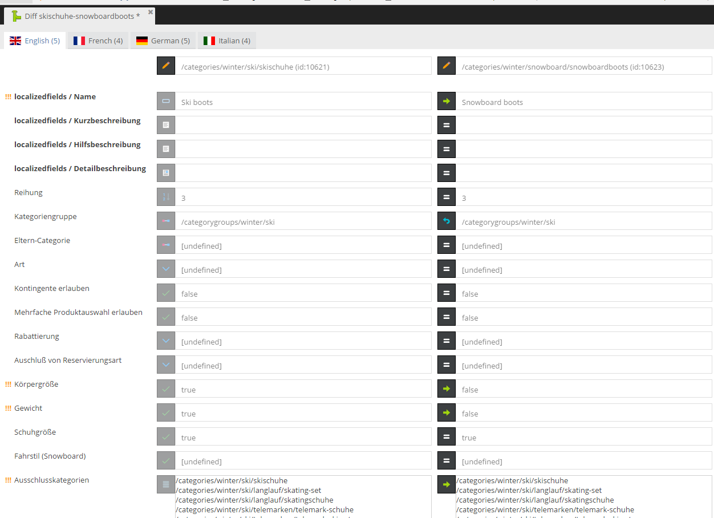

# OpenDXP ObjectMerger Bundle

***

## Disclaimer

> OpenDXP is a community-driven fork based on the Pimcore® Community Edition (GPLv3).  
> OpenDXP is independent and maintained by its community and contributors.
> It is not affiliated with, endorsed by, or sponsored by Pimcore GmbH.   
> Original credits: [Pimcore GmbH](https://www.pimcore.com)

**OpenDXP ObjectMerger Bundle is based on the Pimcore® Community Edition and remains licensed under GPLv3.**

***

The object merger plugin allows to show the difference between two objects and merge them field by field. For the keyvalue datatype the field is even broken down into key/value pairs.

Open the object selection menu via the Extras | Compare Objects menu item.

You can either paste the full path of the two objects or use the magnifier class to open the search dialog.

Ideally, the two objects should be of the same type.

Click on the Compare button to show the difference between the two objects. You will see a tab for every language. If the objects don't contain any localized fields the tab label will be "Default". The number inside the parenthesis indicate the current number of differences.

The first row shows the full path of both objects. Below that all object fields are listed.

There are 6 columns:

* The exclamation mark indicates that the field content differs
* The second column is the field label
* The (grayed out) button indicates the field type
* The fourth column summarizes the content of the source object. Changes are always applied from the left object to the right object.
* The button in the middle allows to overwrite the data of the target object with the one from the source object. The button turns into a "revert" button which will undo the change.
* The sixth column summarizes the new content of the target object.

Click on save to apply the changes.

### Customizations

The development of the plugin has been discontinued. It has been customized for Kautbullinger where the further development effort was put into. A special requirement for Kautbullinger is that it should be able to show the difference between objects which exist in RAM only, i.e. they haven't been saved before.

In addition it offers two additional features:

* Apply everything at once
* Show/Hide fields that are equal (defaults to hide)

***

## Upstream Origin & Version Transparency
This project is a fork of the [Pimcore object-merger (685231e / v4.1.0)](https://github.com/pimcore/object-merger/tree/685231eb6198eb3b764903bcdba4c7b3d26a605e), which is © Pimcore GmbH and licensed under GPLv3.

## License
Licensed under the GNU General Public License v3.0 (GPLv3). For details, please see [LICENSE.md](LICENSE.md).

## Copyright
© Pimcore GmbH  
© 2025 OpenDXP Contributors — GPLv3

## Trademarks
Pimcore® is a registered [trademark](https://www.trademarkelite.com/europe/trademark/trademark-detail/009309841/PIMCORE) of Pimcore GmbH.
Any use of the Pimcore® mark in this repository is purely descriptive to identify the original upstream project.

***

## Contact
For inquiries, suggestions, or contributions, feel free to reach us at contact@opendxp.ch.

## About
OpenDXP is a community-driven project initiated by [DACHCOM.DIGITAL](https://www.dachcom.com/de-ch) (Rheineck, Switzerland) and maintained by its community and contributors.
OpenDXP is independent and not affiliated with Pimcore GmbH.

The project’s purpose is to preserve and maintain a GPLv3‑licensed codebase for community use.

It is **not positioned as a competitor** to products or services of Pimcore GmbH and does **not** purport to replace or supersede any Pimcore offering.   
